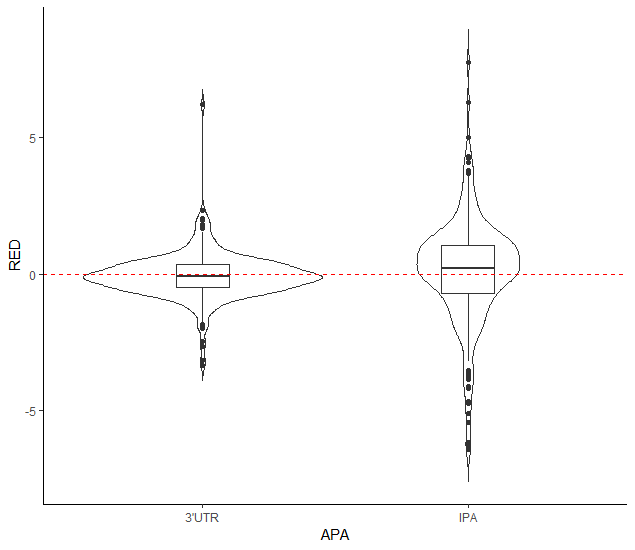
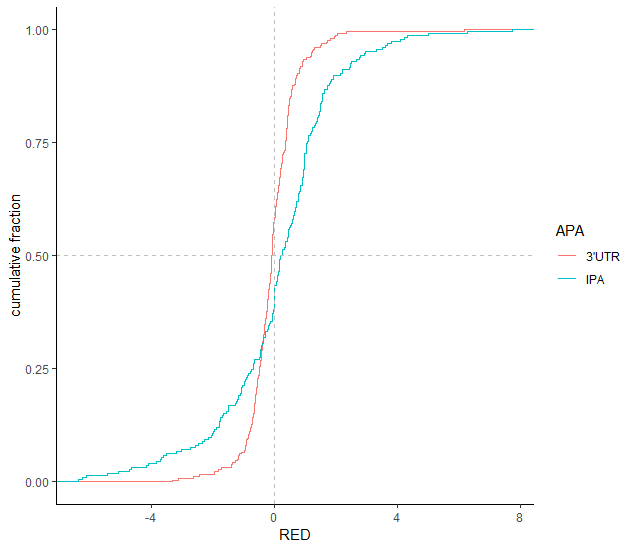

# About APAlyzer
APAlyzer is a toolkit for bioinformatic analysis of alternative polyadenylation 
(APA) events using RNA sequencing data. Our main approach is comparison of s
equencing reads in regions demarcated by high quality polyadenylation sites 
(PASs) annotated in the PolyA_DB database 
(http://exon.njms.rutgers.edu/polya_db/v3/) [@Wang_2017; @Wang_2018]. 
The current version (v1.0) uses RNA-seq data to examine APA events in 3’ 
untranslated regions (3’UTRs) and in introns. The coding regions are used 
for gene expression calculation.

# Program installation
APAlyzer should be installed using BiocManager:

```{r eval=FALSE}
if (!"BiocManager" %in% rownames(installed.packages()))
     install.packages("BiocManager")
BiocManager::install("APAlyzer")
```
Alternatively, it can also be installed as follows:

```{r eval=FALSE}
R CMD INSTALL APAlyzer.tar.gz
```

After installation, APAlyzer can be used by:
```{r eval=FALSE}
library(APAlyzer)
```


# Sample data 

## RNA-seq BAM files
The package reads BAM file(s) to obtain read coverage information in different 
genomic regions. The following example shows that we first specify paths to 
example BAM files in the `r BiocStyle::Biocpkg("TBX20BamSubset")` 
[@TBX20BamSubset] data package. In this example, 
BAM files correspond to mouse RNA-seq data, (mapped to mm9).

```{r eval=FALSE}
library("TBX20BamSubset")
library("Rsamtools")
flsall <- getBamFileList()
flsall
```

## Genomic reference
PAS references in the genome (both 3’UTRs and introns) are required by our 
package. We have pre-built a reference file for the mouse genome (mm9), 
which can be loaded from `extdata`:
```{r}
extpath <- system.file("extdata", "mm9_REF.RData", package="APAlyzer")
load(extpath, verbose=TRUE)
```
This `extdata` covers 3’UTR APA regions (refUTRraw), IPA regions (dfIPA), 
and 3’-most exon regions (dfLE). The `refUTRraw` is a data frame containing 
6 columns for genomic information of 3’UTR PASs:
```{r}
head(refUTRraw,2)
```
`dfIPA` is a data frame containing 8 columns for Intronic PASs; ‘upstreamSS’ 
means the closest 5’ or 3’ splice site to IPA, ‘downstreamSS’ 
means closest 3’ splice site:
```{r}
head(dfIPA,2)
```
`dfLE` is a data frame containing 5 colmuns for 3’ least exon; 
‘LEstart’ means the start genomic position of last 3’ exon.
```{r}
head(dfLE,2)
```

In additions to mouse mm9, our package has also a pre-build version 
for human hg19 genome:
```{r}
extpath <- system.file("extdata", "hg19_REF.RData", package="APAlyzer")
load(extpath, verbose=TRUE)
```


# Analysis of APA in 3’UTRs

## Building aUTR and cUTR references
To calculate 3’UTR APA relative expression (RE), we first need to define 
the refence regions of aUTR and cUTR using `refUTRraw`. Since the sample 
data only contains mapping information on chr19, we can zoom into 
reference regions on chr19 only:
```{r eval=FALSE}
refUTRraw=refUTRraw[which(refUTRraw$Chrom=='chr19'),]
UTRdbraw=REF3UTR(refUTRraw)
```
The `REF3UTR` function returns a genomic range containing aUTR(pPAS to dPAS) 
and cUTR(cdsend to pPAS) regions for each gene:
```{r, echo = FALSE}
library(APAlyzer)
extpath <- system.file("extdata", "mm9_REF.RData", package="APAlyzer")
load(extpath)
refUTRraw=refUTRraw[which(refUTRraw$Chrom=='chr19'),]
UTRdbraw=REF3UTR(refUTRraw)
```
```{r}
head(UTRdbraw,2)
```

## Calculation of relative expression 
Once cUTR and aUTR regions are defined, the RE of 3’UTR APA of each gene 
can be calculated by `PASEXP_3UTR`:
```{r, echo = FALSE}
options(warn=-1)
suppressMessages(library(APAlyzer))
suppressMessages(library("TBX20BamSubset"))
suppressMessages(library("Rsamtools"))
extpath <- system.file("extdata", "mm9_REF.RData", package="APAlyzer")
load(extpath)
flsall <- getBamFileList()
refUTRraw=refUTRraw[which(refUTRraw$Chrom=='chr19'),]
UTRdbraw=REF3UTR(refUTRraw)
```

```{r}
DFUTRraw=PASEXP_3UTR(UTRdbraw, flsall, Strandtype="forward")
```
The `PASEXP_3UTR` 3UTR requires two inputs: 1) aUTR and cUTR 
reference regions, and 2) path of BAM file(s). In additions 
to input, one can also define the strand of the 
sequencing using `Strandtype`. The detailed usage can also 
be obtained by the command `?PASEXP_3UTR`.The output data 
frame covers reads count (in aUTR or cUTR), RPKM (in 
aUTR or cUTR) and RE (log2(aUTR/cUTR)) for each gene:
```{r}
head(DFUTRraw,2)
```

# Analysis of APA in introns

## Building intronic polyA references
Analysis of IPA requires two genomic regions: IPA regions and 3’-most exons. 
As mentioned above, these regions in mouse and human genomes have been 
pre-built in the package:

```{r eval=FALSE}
#mouse(mm9):
extpath <- system.file("extdata", "mm9_REF.RData", package="APAlyzer")
load(extpath)
```

```{r eval=FALSE}
#human(hg19):
extpath <- system.file("extdata", "hg19_REF.RData", package="APAlyzer")
load(extpath)
```

## Calculation of relative expression 
Similar to 3’UTR APA, RE of IPAs can be calculated using PASEXP_IPA: 
`PASEXP_IPA`:
```{r eval=FALSE}
dfIPA=dfIPA[which(dfIPA$Chrom=='chr19'),]
dfLE=dfLE[which(dfLE$Chrom=='chr19'),]
IPA_OUTraw=PASEXP_IPA(dfIPA, dfLE, flsall, Strandtype="forward", nts=1)
```
Note that, as a specific feature for IPA, one can set more threads using 
‘nts=’ to increase calculation speed. The detailed usage 
can be obtained by the command `?PASEXP_IPA`.

The output data frame contains read count and read density IPA upstream (a), 
IPA downstream (b) and 3’-most exon region (c). 
The RE of IPA is calculated as log2((a - b)/c).

```{r, echo = FALSE}
extpath <- system.file("extdata", "mm9_TBX20.APAout.RData", package="APAlyzer")
load(extpath)
```

```{r}
head(IPA_OUTraw,2)
```

# Significance analysis of APA events

Once the read coverage information is obtained for each sample, 
one can compare APA regulation difference between two different groups. 
In this analysis, there are two types of experimental design: 
1) without replicates; 2) with replicates. 
A sample table will be generated according to the design:

```{r, echo = FALSE}
options(warn=-1)
extpath <- system.file("extdata", "mm9_TBX20.APAout.RData", package="APAlyzer")
load(extpath)
```

```{r}
# Build the sample table with replicates
sampleTable1 = data.frame(samplename = c(names(flsall)),
                    condition = c(rep("NT",3),rep("KD",3)))
sampleTable1
```

```{r}
# Build the sample table without replicates
sampleTable2 = data.frame(samplename = c("SRR316184","SRR316187"),
                    condition = c("NT","KD")) 
sampleTable2
```


## Significantly regulated APA in 3’UTRs

To analyze 3’UTR APA between samples (KD and NT groups in the example) 
without replicates, `sampleTable2` is used. The function 
used here is called `APAdiff` (detailed information can be obtained by the 
command `?APAdiff`). It will fist to go through the sample table to 
determine whether it is a replicate design or non-replicate design. 
Then the APA compassion will be performed.
```{r}
# Analysis 3'UTR APA between KD and NT group using non-repilicate design
test_3UTRsing=APAdiff(sampleTable2,DFUTRraw, 
                        conKET='NT',
                        trtKEY='KD',
                        PAS='3UTR',
                        CUTreads=0)
```
The `APAdiff` function requires two inputs: 1) A sample table defining 
groups/conditions of the samples, and 2) read coverage information of 
aUTRs and cUTRs, which can be obtained by `PASEXP_3UTR` from the previous 
step. The group name, i.e., treatment or control, can be defined b 
`trtKEY=` and `conKET=`; the PAS type analyzed should be defined by `PAS=`; 
and the read cutoff used for aUTR and cUTR is defined by `CUTreads=` 
with the default value being 0. In the non-replicate design, the APA pattern 
will be compared between two samples and output will be shown in a data frame:
```{r}
head(test_3UTRsing,2)
table(test_3UTRsing$APAreg)
```
The output contains 4 columns: ‘gene symbol’ describes gene information; 
‘RED’ is relative expression difference between two groups; ‘pvalue’ is 
statistical significance based on the Fisher’s exact test; and ‘APAreg’ 
is 3’UTR APA regulation pattern in the gene. We define 3 types in ‘APAreg’, 
‘UP’ means aUTR abundance in the treatment group (‘KD’ in this case) is at 
least 5% higher than that in control (‘NT’ in this case), and ‘pvalue’<0.05; 
‘DN’ means aUTR abundance is 5% lower in treatment than that in control and  
p-value<0.05; ‘NC’ are the remaining genes. With respect to 3’UTR size changes, 
‘UP’ means 3’UTR shortening, and ‘DN’ 3’UTR lengthening.

For the replicate design, we use t-test for significance analysis. However, 
other tools based on negative binomial data distribution, such as  
`r BiocStyle::Biocpkg("DEXSeq")` [@DEXSEQ] might also be used.
```{r}
# Analysis 3'UTR APA between KD and NT group using multi-repilicate design
test_3UTRmuti=APAdiff(sampleTable1,
                        DFUTRraw, 
                        conKET='NT',
                        trtKEY='KD',
                        PAS='3UTR',
                        CUTreads=0)
head(test_3UTRmuti,2)
table(test_3UTRmuti$APAreg)
```
In the replicate design, ‘RED’ is difference of averaged relative expression 
between two groups; ‘pvalue’ is the p-value from t-test. In this case, 
‘UP’ is defined as ‘RED’ <0 and ‘pvalue’ <0.05; while ‘DN’ is the opposite; 
and ‘NC’ is the remaining genes.

## Significantly regulated APA in introns
IPA comparison is similar to 3’UTR APA using `APAdiff`, except that it 
(1) uses IPA expression as input, and (2) ‘PAS=’ needs to be defined as 
‘IPA’, and (3) the analysis is performed on each IPA. Note that, the direction 
of IPA regulation is opposite to that of 3’UTR APA. This means ‘UP’ is defined 
as up-regulation of IPA (RED > 0); ‘DN’ is the opposite; 
and ‘NC’ is the remaining genes.

Analysis of IPA between KD and NT groups without replicates is shown here:
```{r} 
test_IPAsing=APAdiff(sampleTable2,
                        IPA_OUTraw, 
                        conKET='NT',
                        trtKEY='KD',
                        PAS='IPA',
                        CUTreads=0) 
head(test_IPAsing,2)
```

Analysis of IPA between KD and NT groups using replicate data is shown here:
```{r}
test_IPAmuti=APAdiff(sampleTable1,
                        IPA_OUTraw, 
                        conKET='NT',
                        trtKEY='KD',
                        PAS='IPA',
                        CUTreads=0)
head(test_IPAmuti,2)
```  

# Visualization of analysis results
APA comparison result can be plotted using either boxplots or violin plots or 
CDF curves. For the previous 3’UTR APA and IPA comparison outputs, one needs 
to first build the plotting data frame: 
```{r, echo = FALSE}
options(warn=-1)
extpath <- system.file("extdata", 
                        "mm9_TBX20.APAdiff_OUT.RData", 
                        package="APAlyzer")
load(extpath)
```
```{r}
test_3UTRmuti$APA="3'UTR"
test_IPAmuti$APA="IPA"
dfplot=rbind(test_3UTRmuti[,c('RED','APA')],test_IPAmuti[,c('RED','APA')])
```
To make violin plots and CDF curves using `r BiocStyle::Biocpkg("ggplot2")`:
```{r}
library(ggplot2)
```

```{r eval=FALSE}
###violin
ggplot(dfplot, aes(x = APA, y = RED)) + 
    geom_violin(trim = FALSE) + 
    geom_boxplot(width = 0.2)+ 
    geom_hline(yintercept=0, linetype="dashed", color = "red")
```

```{r out.width = '75%', echo = FALSE}
library(knitr)

```

```{r eval=FALSE}
###CDF
ggplot(dfplot, aes( x = RED, color = APA)) + 
    stat_ecdf(geom = "step") +
    ylab("cumulative fraction")+ 
    geom_vline(xintercept=0, linetype="dashed", color = "gray")+ 
    geom_hline(yintercept=0.5, linetype="dashed", color = "gray")
```

```{r out.width = '75%', echo = FALSE}

```

# Gene expression analysis using coding regions
APA is frequently involved in gene expression regulation. To compare gene 
expression vs. APA in different samples, our package provides a simple 
function to assess the expression changes using RNA-seq reads 
mapped to coding sequences.

## Building coding region references 
```{r eval=FALSE}
library("GenomicFeatures")
library("org.Mm.eg.db")
txdb <- makeTxDbFromUCSC(genome="mm9", tablename="refGene")
seqlevels(txdb) <-"chr19"
IDDB <- org.Mm.eg.db
CDSdbraw=REFCDS(txdb,IDDB)
```

## Calculation of expression 
```{r eval=FALSE}
DFGENEraw=GENEXP_CDS(CDSdbraw, flsall, Strandtype="forward")
```

# FAQs

**How to generate a BAM file list for analysis?**


A BAM file list containing both BAM file names and paths of the files. 
Let’s say all the BAM files are stored in bamdir, then BAM file lists 
can be obtained through:

```{r eval=FALSE}
flsall <- dir(bamdir,".bam")
flsall<-paste0(bamdir,flsall)
names(flsall)<-dir(bamdir,".bam")
```  

**Why am I getting error messages when I try to get txdb using makeTxDbFromUCSC?**


You can try either upgrade your Bioconductor, or load the genome annotation 
using GTF, or load the prebuild genome annotation using ‘.R.DB’ file, 
e.g., mm9.refGene.R.DB. 

# Session Information
The session information records all the package versions used in 
generation of the present document.

```{r sessionInfo}
sessionInfo()
```

# Acknowledgements
We thank members of the Bin Tian lab for helpful discussions 
and package testing.

# References

